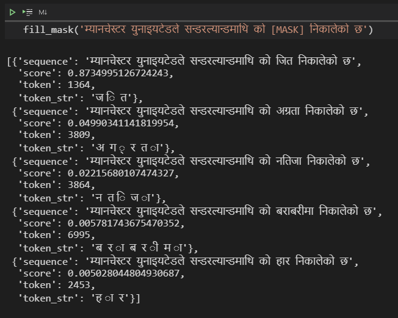
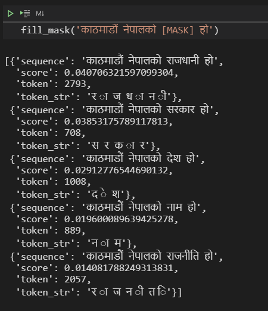
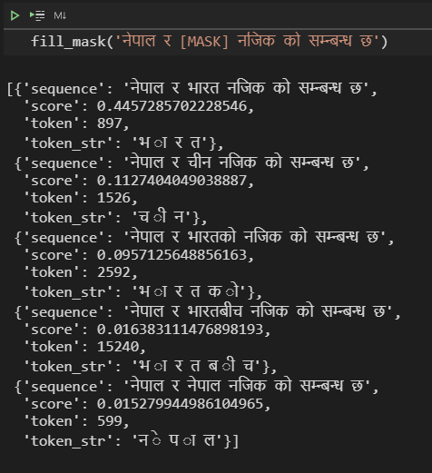
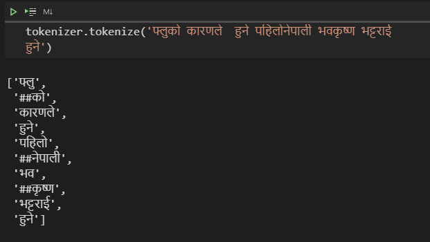

<span style="font-size: 250%;color:Orange">***NEPALI BERT(Phase 1)***</span>.


NEPALIBERT is a state-of-the-art language model for Nepali based on the BERT model. The model is trained using a masked language modeling (MLM). 


# Loading the model and tokenizer 
1. clone the model repo 
```
git lfs install
git clone https://huggingface.co/Rajan/NepaliBERT
```
2. Loading the Tokenizer 
```
from transformers import BertTokenizer
vocab_file_dir = './NepaliBERT/' 
tokenizer = BertTokenizer.from_pretrained(vocab_file_dir,
                                        strip_accents=False,
                                         clean_text=False )
```
3. Loading the model:
```
from transformers import BertForMaskedLM
model = BertForMaskedLM.from_pretrained('./NepaliBERT')
```

The easiest way to check whether our language model is learning anything interesting is via the ```FillMaskPipeline```.

Pipelines are simple wrappers around tokenizers and models, and the 'fill-mask' one will let you input a sequence containing a masked token (here, [mask]) and return a list of the most probable filled sequences, with their probabilities.

```
from transformers import pipeline

fill_mask = pipeline(
    "fill-mask",
    model=model,
    tokenizer=tokenizer
)
```
### ```Now, lets see some outputs: ```





### ```Finally, lets visualize the tokenizer: ```


Model Config: 
```
{
  "architectures": [
    "BertForMaskedLM"
  ],
  "attention_probs_dropout_prob": 0.1,
  "gradient_checkpointing": false,
  "hidden_act": "gelu",
  "hidden_dropout_prob": 0.1,
  "hidden_size": 768,
  "initializer_range": 0.02,
  "intermediate_size": 3072,
  "layer_norm_eps": 1e-12,
  "max_position_embeddings": 512,
  "model_type": "bert",
  "num_attention_heads": 12,
  "num_hidden_layers": 6,
  "pad_token_id": 0,
  "position_embedding_type": "absolute",
  "transformers_version": "4.7.0.dev0",
  "type_vocab_size": 2,
  "use_cache": true,
  "vocab_size": 50000
}
```


# Training procedure

Nepali-Bert was trained on 67 lakhs line of raw Nepali text data. The fianl data set was formed by combaining [A LARGE SCALE NEPALI TEXT CORPUS](https://ieee-dataport.org/open-access/large-scale-nepali-text-corpus) and [Oscar](https://oscar-corpus.com/) dataset. 
Final version training datset after complete preprocessing is shown: 

```
सोमबार उनको पुण्यतिथीको औँ दिन पुगेको छ ।
उनको काजक्रिया भने दिनमै सकिएको छ ।
आइतबार घरमा पुग्दा शुभचिन्तकको भीड उत्तिकै थियो ।
तर त्यो भिडका सबैको अनुहारको औंशीको रातझैं निभेको मैनबत्तीजस्तो थिए।
मनमा पीडा राखेर अनुहारमा कृतिम हाँसो छर्दै विद्या शुभचिन्तकको सम्मानमा जुटिरहेकी थिइन् ।

```


